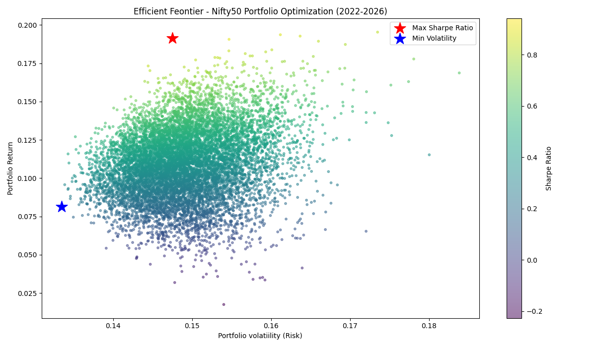
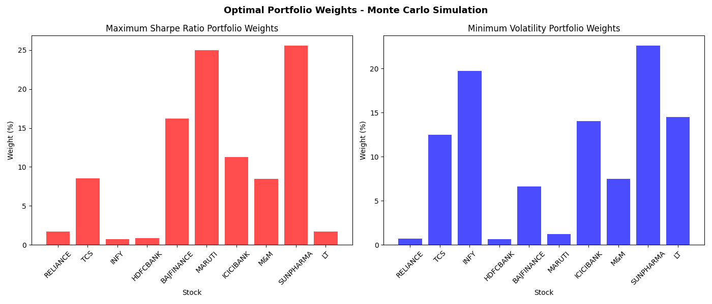

# Nifty50-Portfolio-Optimization-using-Monte-Carlo-Simulation

## Overview
This project applies Monte Carlo simulation and Modern Portfolio 
Theory (Markowitz model) to find the optimal allocation across 
10 Nifty50 stocks. The goal is to identify which combination of 
stocks maximizes risk-adjusted returns and which minimizes overall 
portfolio risk. Built using Python, yfinance, NumPy, and Matplotlib.

## Data Source
- Source: yfinance Python library
- Stocks: RELIANCE, TCS, INFY, HDFCBANK, BAJFINANCE, MARUTI, 
  ICICIBANK, M&M, SUNPHARMA, LT
- Period: January 2022 to April 2026
- Frequency: Daily closing prices

## The Math 

**Sharpe Ratio:** Measures how much return a portfolio generates 
per unit of risk taken, above the risk-free rate (India repo rate: 
5.25%). A higher Sharpe ratio means better risk-adjusted performance.

**Efficient Frontier:** The curved boundary of all possible 
portfolios plotted on a risk vs return chart. Every point on this 
curve represents a portfolio that gives the maximum possible return 
for a given level of risk. Portfolios inside the curve are 
suboptimal.

**Optimal Portfolio:** The specific combination of stock weights 
that either maximizes the Sharpe ratio or minimizes volatility 
across 10,000 randomly simulated portfolios.

**Monte Carlo Simulation:** 10,000 portfolios with random weight 
combinations are generated. Each is evaluated for return, 
volatility, and Sharpe ratio. The best combinations are identified 
from this random search.

## Key Findings

**Maximum Sharpe Ratio Portfolio (Return: ~21%, Volatility: ~16%)**
The optimal risk-adjusted portfolio allocates heavily to Maruti 
(~25%), Sun Pharma (~26%), and Bajaj Finance (~20%), with minimal 
allocation to Reliance, TCS, and L&T. This portfolio maximizes 
return per unit of risk taken.

**Minimum Volatility Portfolio (Return: ~10%, Volatility: ~13%)**
The lowest-risk portfolio favors Sun Pharma (~23%), Infosys (~16%), 
ICICI Bank (~15%), and L&T (~17%). These stocks provide stability 
through diversification across defensive and infrastructure sectors.

**Sun Pharma appears heavily in both portfolios** because it 
delivers strong returns relative to its volatility and moves 
independently of banking and IT stocks — making it valuable for 
both return maximization and risk reduction.

**Reliance receives near-zero allocation** despite being India's 
largest company by market cap. Its annual return of 7.38% over 
2022-2026 was among the lowest in the portfolio while carrying 
similar volatility to higher-returning stocks — poor risk-adjusted 
value.

**TCS and Infosys showed negative annual returns** over this period, 
reflecting the broad selloff in Indian IT stocks driven by US rate 
hikes and slowing global tech demand.

## Visualizations

### Efficient Frontier

10,000 simulated portfolios plotted by risk vs return, colored by 
Sharpe ratio. The red star marks the Maximum Sharpe portfolio. 
The blue star marks the Minimum Volatility portfolio.

### Optimal Portfolio Weights

Side-by-side comparison of stock allocations in the Maximum Sharpe 
and Minimum Volatility portfolios.

## Limitations
- Monte Carlo simulation approximates the optimal portfolio through 
  random sampling — mathematical optimization would give a more 
  precise result
- Results change slightly each run without a random seed (np.random.seed(42) 
  is set for reproducibility)
- Based on historical data — past performance does not guarantee 
  future returns
- Does not account for transaction costs, taxes, or liquidity constraints

## How to Run
pip install pandas numpy matplotlib yfinance
python portfolio.py

## Author
Yashraj Patil
